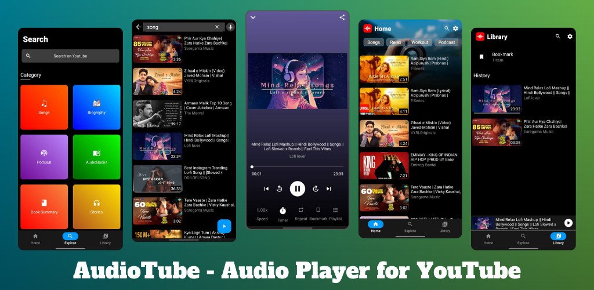
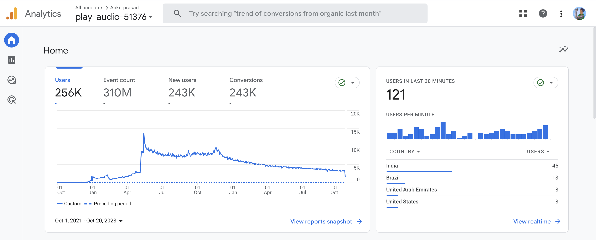

# 🎧 Audiotube: 100K+ installs on Playstore!

## Introduction

Welcome to the Audiotube project repository! Audiotube is an innovative Android app that allows users to listen to YouTube videos in the background, enabling a seamless audio playback experience. With Audiotube, users can enjoy their favorite YouTube content while using other apps or when the screen is turned off.
The app has gained significant popularity with over 100k+ installs and a peak of 11k+ daily active users, all achieved through organic growth.

Snapshot of Audiotube Analytics Page in Google Analytics

## Features

- Background audio playback: Audiotube allows users to listen to any YouTube video as audio, even when the app is minimized or the screen is off.
- Seamless user experience: Users can enjoy uninterrupted audio playback while using other apps or performing other tasks on their device.
- Easy navigation and control: The app provides a user-friendly interface for effortless browsing and playback control of YouTube videos.
- Playlist support: Users can create and manage playlists to organize their favorite YouTube audio tracks.
- Search and discover: Audiotube offers a powerful search functionality to find and discover YouTube audio content.

## Installation

To install Audiotube, follow these steps:

1. Download the latest APK from the [debug](app_storage/app-debug.apk) section.
2. Enable installation from unknown sources in your device settings.
3. Locate the downloaded APK and tap on it to begin the installation process.
4. Follow the on-screen instructions to complete the installation.

## Usage
After installing Audiotube, launch the app on your Android device. You will be greeted with the home screen where you can search for YouTube videos or access your playlists. Tap on a video to start playing it as audio. You can control playback using the on-screen controls or by using the notification panel.

## Technologies Used
- Android
- Kotlin
- YouTube API
- Exoplayer
- Retrofit

## Current Status of the App
Currently, the app is not available on the Play Store due to Play Store policies. However, you can still download and use the debug version. We are actively working on making it available in alternative app marketplaces. Stay tuned for updates!

## Contributing
Contributions to Audiotube are welcome! If you would like to contribute to the project, please follow the guidelines outlined in the [CONTRIBUTING.md](/CONTRIBUTING.md) file.

## License
Audiotube is released under the [MIT License](/LICENSE).

## Contact

For any inquiries or feedback, please reach out to us at [ankitpr2001@gmail.com](mailto:ankitpr2001@gmail.com).
